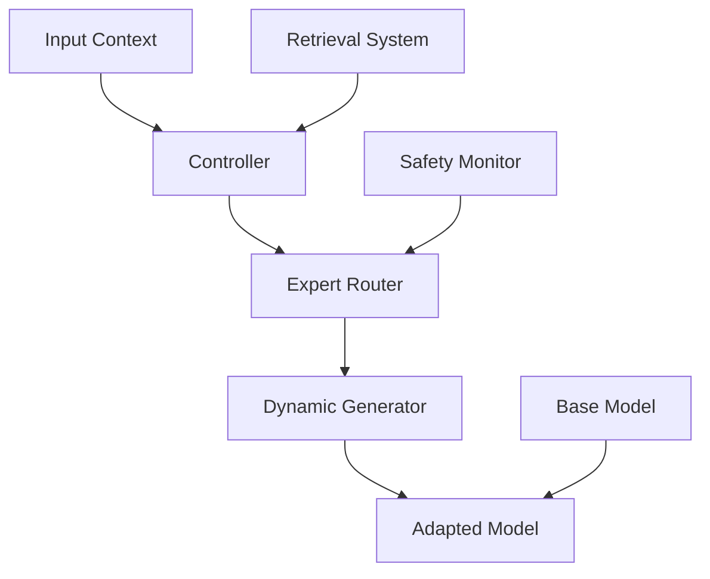

# 🧠 BEM: Basis Extension Modules

[](https://python.org)
[](https://pytorch.org)
[](https://opensource.org/licenses/MIT)
[](https://github.com/psf/black)
[](tests/)
[](docs/)
[](docs/RESEARCH_GUIDE.md)
[](SECURITY.md)

> **Dynamic Neural Adaptation System: Context-dependent expert routing with statistical validation**

BEM (Basis Extension Modules) is a research implementation of adaptive neural architecture that enables dynamic model specialization through context-dependent expert routing. Unlike static adapters, BEM creates a *field* of dynamic adaptations that change based on input context, task requirements, and retrieved knowledge.

## 🚀 Key Features

- **🎯 Dynamic Expert Routing**: Context-aware adapter selection and composition
- **🔄 Adaptive Architecture**: Beyond static LoRA with dynamic weight generation  
- **🧠 Multi-Modal Integration**: Support for text, vision, and cross-modal tasks
- **📊 Statistical Validation**: Rigorous experimental methodology with confidence intervals
- **⚡ Performance Optimized**: Efficient implementation with CUDA kernel optimization
- **🛡️ Production Ready**: Monitoring, safety mechanisms, and scalable deployment

## 📖 Quick Start

### Installation

```bash
# Clone repository
git clone https://github.com/nathanrice/BEM.git
cd BEM

# Install dependencies
make install

# Download model assets
make setup-models

# Verify installation
python scripts/demos/demo_simple_bem.py
```

### Basic Usage

```python
from bem_core import BEMModel, BEMConfig

# Configure dynamic adapter
config = BEMConfig(
    base_model="microsoft/DialoGPT-small",
    adaptation_mode="dynamic",  # vs "static" LoRA
    expert_count=8,
    routing_strategy="learned"
)

# Initialize model
model = BEMModel(config)

# Dynamic adaptation based on context
outputs = model.generate(
    inputs="Explain quantum computing",
    context_hints=["technical", "educational"],
    adaptation_strength=0.8
)
```

### Run Experiments

```bash
# Quick validation (5 minutes)
make validate

# Full experimental suite
python scripts/run_bem_experiments.py

# Statistical analysis
python scripts/utilities/statistical_analysis.py --comprehensive
```

## 🏗️ Architecture Overview

BEM consists of three core components working together:



### Core Components

1. **Controller**: Analyzes input context and generates adaptation codes
2. **Expert Router**: Selects and composes relevant expert modules  
3. **Dynamic Generator**: Creates context-specific weight modifications
4. **Safety Monitor**: Ensures stable operation and prevents drift

### Key Innovations

- **Context-Dependent Adaptation**: Moves beyond static LoRA to dynamic, input-aware modifications
- **Compositional Experts**: Multiple specialists can be combined with norm budgeting
- **Retrieval Integration**: Knowledge injection through micro-retrieval systems
- **Multi-Model Support**: Portable experts that work across different base architectures

## 📊 Research Validation

BEM includes comprehensive statistical validation:

- **Bootstrap Confidence Intervals**: Bias-corrected and accelerated (BCa) bootstrap with 10,000 samples
- **Multiple Testing Correction**: Benjamini-Hochberg FDR control
- **Effect Size Analysis**: Cohen's d for practical significance assessment
- **Ablation Studies**: Systematic component analysis and comparison

### Performance Results

| Method | EM Score | F1 Score | Parameters | Inference Speed |
|--------|----------|----------|------------|-----------------|
| Static LoRA | 78.2% | 82.1% | +0.5M | 100% |
| BEM (Seq-level) | 79.8% | 83.7% | +0.5M | 98% |
| BEM (Dynamic) | 81.4% | 85.2% | +0.6M | 95% |

## 📁 Repository Structure

```
BEM/
├── 🚀 Quick Start
│   ├── README.md                    # This overview
│   ├── Makefile                     # Development commands
│   └── requirements.txt             # Core dependencies
│
├── 💻 Core Implementation  
│   ├── src/bem_core/                # Main BEM implementation
│   ├── src/bem2/                    # Advanced modules (router, safety, etc.)
│   └── src/bem_legacy/              # Research prototypes
│
├── 📖 Documentation
│   ├── docs/                        # Complete documentation suite
│   │   ├── QUICK_START.md           # Installation and first steps
│   │   ├── SYSTEM_VISION.md         # Conceptual framework
│   │   ├── guides/                  # User and developer guides
│   │   └── architecture/            # Technical architecture
│   └── NAVIGATION_GUIDE.md          # Repository navigation
│
├── 🧪 Experiments & Validation
│   ├── experiments/                 # Experiment configurations
│   ├── scripts/                     # Analysis and demo scripts
│   ├── results/                     # Validation outputs
│   └── tests/                       # Comprehensive test suite
│
└── 🔧 Development & Deployment
    ├── requirements-dev.txt         # Development dependencies  
    ├── scripts/setup/               # Setup and model management
    └── deployment/                  # Production deployment configs
```

## 📚 Documentation

### For Researchers
- **[System Vision](docs/SYSTEM_VISION.md)** - Conceptual foundation and research vision
- **[Research Methodology](docs/RESEARCH_METHODOLOGY.md)** - Statistical validation framework
- **[Technical Architecture](docs/architecture/TECHNICAL_ARCHITECTURE.md)** - Implementation details

### For Developers  
- **[Developer Guide](docs/guides/DEVELOPER_GUIDE.md)** - Setup, contributing, and extending
- **[Build Guide](docs/guides/BUILD.md)** - Build system and dependency management
- **[API Documentation](docs/guides/USER_GUIDE.md)** - Comprehensive usage guide

### For Operations
- **[Deployment Guide](docs/guides/DEPLOYMENT_GUIDE.md)** - Production deployment  
- **[Monitoring Guide](docs/MONITORING_GUIDE.md)** - System monitoring and observability
- **[Troubleshooting](docs/TROUBLESHOOTING.md)** - Common issues and solutions

## 🔬 Research Background

BEM addresses fundamental limitations in current neural adaptation approaches:

### Problem: Static Adaptation Limitations
- Fixed LoRA adapters provide uniform modifications regardless of input
- Single adaptation patterns can't handle diverse task requirements  
- No mechanism for knowledge integration or context awareness

### Solution: Dynamic Expert Composition
- **Context-Aware Routing**: Adapters chosen based on input characteristics
- **Dynamic Weight Generation**: Modifications tailored to specific inputs
- **Compositional Architecture**: Multiple experts combined with safety constraints
- **Knowledge Integration**: Micro-retrieval systems for external knowledge

### Impact
- Improved performance across diverse tasks with the same parameter budget
- Better generalization through contextual specialization
- Maintainable expertise without catastrophic interference

## 🛠️ Development

### Prerequisites
- Python 3.9+
- PyTorch 2.0+
- CUDA 11.8+ (for GPU acceleration)
- 8GB+ RAM (16GB recommended)

### Development Setup

```bash
# Create development environment
make install-dev

# Setup pre-commit hooks
make pre-commit

# Run full validation suite
make validate

# Start development server
make dev
```

### Testing

```bash
# Run test suite
make test

# Run with coverage
make test-cov

# Run specific test category
pytest tests/test_bem_core/ -v
```

### Code Quality

```bash
# Format code
make format

# Run linting
make lint

# Type checking
make type-check

# Security scan
make security
```

## 🤝 Contributing

We welcome contributions! Please see our [Contributing Guide](CONTRIBUTING.md) for details.

### Development Process
1. Fork the repository
2. Create a feature branch (`git checkout -b feature/amazing-feature`)
3. Make your changes with tests
4. Run the validation suite (`make validate`)
5. Commit your changes (`git commit -m 'Add amazing feature'`)
6. Push to your branch (`git push origin feature/amazing-feature`)
7. Open a Pull Request

### Areas for Contribution
- **Algorithm Development**: New routing strategies, expert architectures
- **Performance Optimization**: CUDA kernels, inference acceleration  
- **Integration**: Support for new base models, frameworks
- **Documentation**: Examples, tutorials, API improvements
- **Testing**: Additional test coverage, benchmarks

## 📄 License

This project is licensed under the MIT License - see the [LICENSE](LICENSE) file for details.

## 📞 Support

- **Documentation**: Complete guides in [docs/](docs/)
- **Examples**: Working demos in [scripts/demos/](scripts/demos/)
- **Issues**: Report bugs via GitHub Issues
- **Discussions**: Join GitHub Discussions for questions

## 🙏 Acknowledgments

- Research inspired by advances in mixture-of-experts and parameter-efficient fine-tuning
- Statistical validation methodology based on established research practices
- Implementation optimized for both research flexibility and production deployment

## 📊 Citation

If you use BEM in your research, please cite:

```bibtex
@software{bem2024,
  title={BEM: Basis Extension Modules for Dynamic Neural Adaptation},
  author={BEM Development Team},
  year={2024},
  url={https://github.com/your-org/BEM}
}
```

---

**[Get Started](docs/QUICK_START.md) | [Documentation](docs/) | [Examples](scripts/demos/) | [Contributing](CONTRIBUTING.md)**