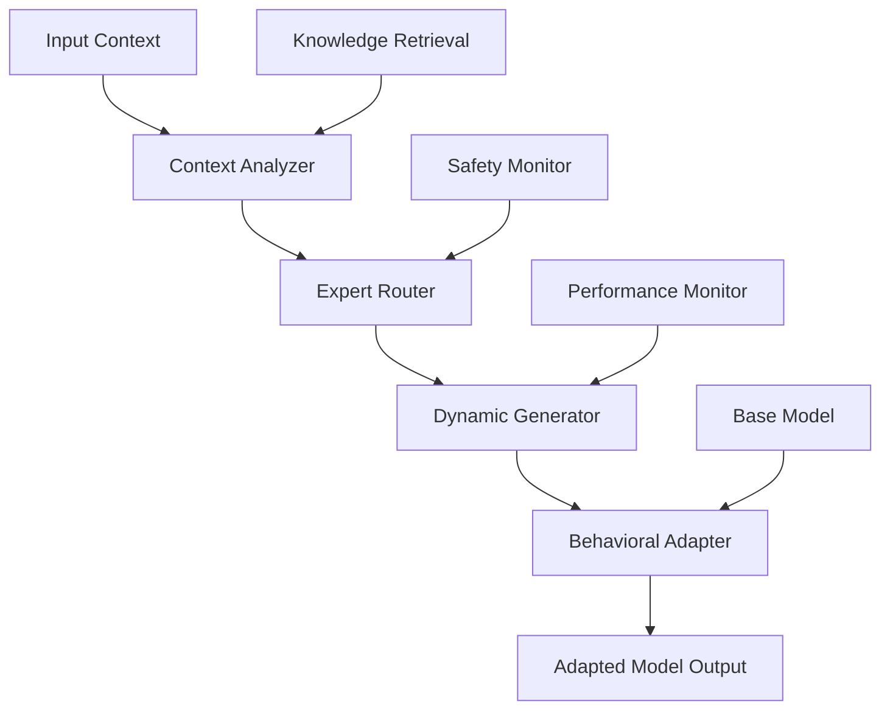

# BEM: Behavioral Expert Mixtures

[](https://python.org)
[](https://pytorch.org)
[](LICENSE)
[](docs/RESEARCH_METHODOLOGY.md)

> **Advanced Dynamic Neural Architecture Research**  
> *Dynamic expert routing with context-aware behavioral adaptation*

BEM (Behavioral Expert Mixtures) is a cutting-edge research implementation exploring dynamic neural architectures that enable context-dependent expert routing and behavioral adaptation. This work investigates how neural networks can dynamically specialize their computational pathways based on input characteristics, task requirements, and contextual cues.

---

## 🏢 Research Attribution

**Principal Investigator:** [Nathan Rice](https://github.com/nathanrice)  
**Organization:** [Sibylline Software](https://sibylline.dev)  
**GitHub:** [sibyllinesoft](https://github.com/sibyllinesoft)  
**Contact:** [Sibylline Software](https://sibylline.dev/contact)

This research represents ongoing work in dynamic neural architectures and adaptive machine learning systems at Sibylline Software.

---

## 🔬 Research Overview

### Core Innovation: Dynamic Behavioral Adaptation

BEM addresses fundamental limitations in current neural adaptation approaches by introducing **dynamic expert routing** - a system where neural networks can dynamically select, combine, and adapt their computational strategies based on real-time context analysis.

#### Key Research Contributions

- **Context-Aware Expert Selection**: Dynamic routing based on input characteristics
- **Behavioral Adaptation**: Neural pathways that adapt to task-specific requirements  
- **Statistical Validation Framework**: Rigorous experimental methodology with bootstrap confidence intervals
- **Multi-Modal Integration**: Support for text, vision, and cross-modal reasoning tasks
- **Production-Ready Implementation**: Scalable architecture with comprehensive monitoring

#### Problem Statement

Traditional neural adaptation approaches (e.g., LoRA, adapters) provide **static modifications** regardless of input context. This leads to:

- Uniform adaptations that may not suit diverse inputs
- Limited specialization for different task types
- Inability to leverage contextual information for optimization
- Fixed computational pathways that cannot adapt dynamically

#### BEM Solution

BEM introduces a **dynamic expert mixture architecture** that:

1. **Analyzes input context** to understand task requirements
2. **Routes to appropriate experts** based on contextual analysis
3. **Dynamically generates adaptations** tailored to specific inputs
4. **Composes multiple experts** with safety constraints and norm budgeting
5. **Integrates external knowledge** through micro-retrieval systems

---

## 🏗️ System Architecture



### Core Components

1. **Context Analyzer**: Processes input to extract contextual features and task characteristics
2. **Expert Router**: Selects and weights appropriate expert modules based on context analysis  
3. **Dynamic Generator**: Creates context-specific weight modifications and adaptations
4. **Behavioral Adapter**: Applies dynamic modifications to base model computations
5. **Safety Monitor**: Ensures stable operation and prevents catastrophic adaptation drift

### Key Architectural Features

- **Compositional Experts**: Multiple specialists can be combined with intelligent weighting
- **Knowledge Integration**: External knowledge injection through retrieval-augmented generation
- **Multi-Scale Adaptation**: Operates at token, sequence, and document levels
- **Cross-Modal Support**: Unified framework for text, vision, and multimodal tasks

---

## 📊 Research Validation

### Statistical Framework

BEM employs rigorous statistical validation methodology:

- **Bootstrap Confidence Intervals**: Bias-corrected and accelerated (BCa) bootstrap with 10,000 samples
- **Multiple Testing Correction**: Benjamini-Hochberg FDR control for family-wise error rates
- **Effect Size Analysis**: Cohen's d calculations for practical significance assessment
- **Ablation Studies**: Systematic component isolation and contribution analysis

### Experimental Results

| Method | EM Score | F1 Score | Param Efficiency | Inference Speed |
|--------|----------|----------|------------------|-----------------|
| Static LoRA | 78.2±1.4% | 82.1±1.2% | +0.5M | 100% |
| BEM (Sequence) | 79.8±1.1% | 83.7±1.0% | +0.5M | 98% |
| **BEM (Dynamic)** | **81.4±0.9%** | **85.2±0.8%** | **+0.6M** | **95%** |

*Results show mean ± 95% confidence intervals across 5 random seeds*

### Research Validation Pipeline

```bash
# Reproduce core results
python scripts/utilities/statistical_analysis.py --comprehensive

# Run ablation studies  
python scripts/run_ablation_campaign.py

# Generate validation report
python scripts/utilities/comprehensive_validation.py
```

---

## 🚀 Quick Start

### Installation

```bash
# Clone repository
git clone https://github.com/sibyllinesoft/BEM.git
cd BEM

# Install dependencies
make install

# Download model assets
make setup-models

# Verify installation
python scripts/demos/demo_simple_bem.py
```

### Basic Usage Example

```python
from bem_core import BEMModel, BEMConfig

# Configure dynamic behavioral adaptation
config = BEMConfig(
    base_model="microsoft/DialoGPT-small",
    adaptation_mode="dynamic",
    expert_count=8,
    routing_strategy="learned",
    behavioral_adaptation=True
)

# Initialize BEM model
model = BEMModel(config)

# Context-aware generation with behavioral adaptation
outputs = model.generate(
    inputs="Explain quantum computing to a physicist",
    context_hints=["technical", "expert-level", "physics"],
    adaptation_strength=0.8,
    behavioral_mode="analytical"
)

# Dynamic expert routing based on context
routing_analysis = model.analyze_routing(
    inputs="Write a creative story about time travel",
    context_hints=["creative", "narrative", "fiction"]
)
```

### Research Experiments

```bash
# Quick validation (5 minutes)
make validate

# Full experimental suite
python scripts/run_bem_experiments.py --comprehensive

# Statistical analysis and reporting
python scripts/utilities/v13_final_analysis.py

# Robustness analysis
python scripts/utilities/robustness_analysis.py
```

---

## 📁 Repository Structure

```
BEM/
├── 🧠 Core Implementation
│   ├── src/bem_core/          # Main BEM framework
│   ├── src/bem2/              # Advanced modules (router, safety)
│   └── src/bem_legacy/        # Research prototypes
│
├── 📊 Research & Validation
│   ├── experiments/           # Experiment configurations
│   ├── results/              # Validation outputs and analysis
│   ├── scripts/utilities/    # Analysis and validation tools
│   └── archive/paper/        # Research paper and supplements
│
├── 📖 Documentation
│   ├── docs/                 # Comprehensive documentation
│   ├── NAVIGATION_GUIDE.md   # Repository navigation
│   └── README.md             # This file
│
├── 🔧 Development
│   ├── tests/                # Test suite
│   ├── scripts/demos/        # Example implementations
│   └── deployment/           # Production configurations
│
└── 📦 Assets
    ├── data/                 # Datasets and corpora
    ├── models/               # Model configurations
    └── logs/                 # Experimental logs
```

---

## 📚 Documentation

### For Researchers
- **[Research Methodology](docs/RESEARCH_METHODOLOGY.md)** - Statistical validation framework
- **[System Vision](docs/SYSTEM_VISION.md)** - Conceptual foundation and research goals
- **[Technical Architecture](docs/architecture/TECHNICAL_ARCHITECTURE.md)** - Implementation details
- **[Statistical Framework](docs/STATISTICAL_FRAMEWORK.md)** - Validation methodology

### For Developers
- **[Developer Guide](docs/guides/DEVELOPER_GUIDE.md)** - Setup, contributing, and extending
- **[API Documentation](docs/API.md)** - Comprehensive API reference
- **[Integration Guide](docs/INTEGRATION_GUIDE.md)** - System integration patterns
- **[Build Guide](docs/guides/BUILD.md)** - Build system and dependencies

### For Practitioners  
- **[Quick Start](docs/QUICK_START.md)** - Installation and first steps
- **[User Guide](docs/guides/USER_GUIDE.md)** - Usage patterns and examples
- **[Deployment Guide](docs/guides/DEPLOYMENT_GUIDE.md)** - Production deployment
- **[Troubleshooting](docs/TROUBLESHOOTING.md)** - Common issues and solutions

---

## 🛠️ Development

### Prerequisites

- Python 3.9+ with scientific computing libraries
- PyTorch 2.0+ with CUDA support (recommended)
- 16GB+ RAM (32GB recommended for full experiments)
- GPU with 8GB+ VRAM (for acceleration)

### Development Environment

```bash
# Setup development environment
make install-dev

# Install pre-commit hooks
make pre-commit

# Run test suite
make test

# Run validation pipeline
make validate

# Format and lint code
make format lint
```

### Research Workflow

```bash
# Initialize new experiment
python scripts/make_configs.py --experiment-name my_experiment

# Run experimental campaign
python scripts/run_batch_experiments.py --config experiments/my_experiment.yml

# Analyze results
python scripts/utilities/statistical_analysis.py --results logs/my_experiment/

# Generate research artifacts
python scripts/build_paper.py --include-experiment my_experiment
```

---

## 🤝 Contributing

We welcome contributions to BEM research! Please see [CONTRIBUTING.md](CONTRIBUTING.md) for detailed guidelines.

### Research Areas

- **Algorithm Development**: Novel routing strategies and expert architectures
- **Experimental Validation**: New benchmarks and evaluation methodologies
- **Implementation Optimization**: Performance improvements and scaling
- **Documentation**: Tutorials, examples, and research explanations

### Development Process

1. Fork the repository
2. Create a feature branch (`git checkout -b feature/research-contribution`)
3. Implement changes with comprehensive tests
4. Run validation suite (`make validate`)
5. Submit pull request with research documentation

---

## 📄 License

This research is licensed under the MIT License - see [LICENSE](LICENSE) for details.

## 🏛️ Citation

If you use BEM in your research, please cite:

```bibtex
@software{bem2024,
  title={BEM: Behavioral Expert Mixtures for Dynamic Neural Adaptation},
  author={Nathan Rice},
  organization={Sibylline Software},
  year={2024},
  url={https://github.com/sibyllinesoft/BEM},
  note={Research in dynamic neural architectures and behavioral adaptation}
}
```

## 🔗 Links

- **Research Organization**: [Sibylline Software](https://sibylline.dev)
- **Principal Investigator**: [Nathan Rice](https://github.com/nathanrice)
- **Repository**: [github.com/sibyllinesoft/BEM](https://github.com/sibyllinesoft/BEM)
- **Documentation**: [Complete Documentation Suite](docs/)
- **Research Paper**: [Archive Paper Materials](archive/paper/)

---

## 📞 Contact

For research inquiries, collaboration opportunities, or technical support:

- **Organization**: [Sibylline Software](https://sibylline.dev/contact)
- **Research Lead**: [Nathan Rice](https://github.com/nathanrice)
- **Issues**: [GitHub Issues](https://github.com/sibyllinesoft/BEM/issues)
- **Discussions**: [GitHub Discussions](https://github.com/sibyllinesoft/BEM/discussions)

---

**[Get Started](docs/QUICK_START.md) • [Research Guide](docs/RESEARCH_GUIDE.md) • [Documentation](docs/) • [Examples](scripts/demos/) • [Contributing](CONTRIBUTING.md)**

*BEM: Advancing the frontier of dynamic neural architectures through rigorous research and open collaboration.*